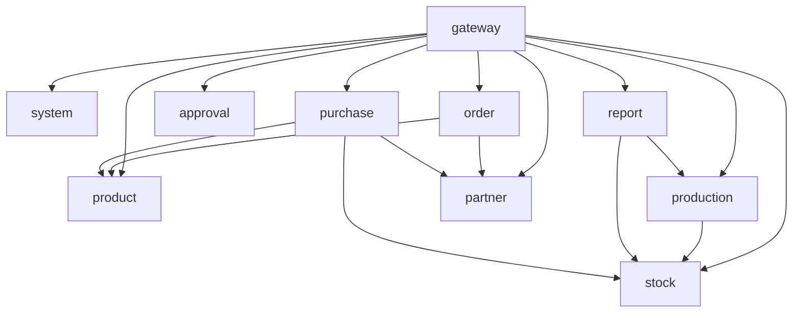

# XEERP 微服务架构分析文档

## 1. 项目概述

本项目是基于 **FastAPI** 框架构建的企业资源规划系统（ERP），采用微服务架构设计，将系统拆分为多个独立服务，每个服务负责特定的业务领域。

### 技术栈

| 分类 | 技术 | 版本 |
|------|------|------|
| 框架 | FastAPI | 0.104+ |
| 数据库 | MySQL | 8.0+ |
| 缓存 | Redis | 7.0+ |
| ORM | SQLAlchemy | 2.0+ |
| 认证 | JWT | - |
| 服务器 | Uvicorn | 0.24+ |

---

## 2. 微服务架构

### 2.1 服务清单

| 服务名称 | 端口 | 职责描述 | 状态 |
|----------|------|----------|------|
| **gateway** | 8000 | 统一入口、路由转发、认证鉴权、限流、跨域 | ✅ 已实现 |
| **system** | 8001 | 用户管理、角色权限、认证授权、系统配置 | ✅ 已实现 |
| **product** | 8002 | 商品管理、分类管理、品牌管理、单位管理 | ✅ 已实现 |
| **stock** | 8003 | 仓库管理、库存管理、库存流水记录 | ✅ 已实现 |
| **production** | 8004 | BOM管理、生产计划、领料、入库、退料、损耗 | ✅ 已实现 |
| **report** | 8005 | 生产进度报表、领料明细报表、入库成本报表、库存台账 | ✅ 已实现 |
| **approval** | 8006 | 统一审批流程、审批实例管理 | ✅ 已实现 |
| **partner** | 8007 | 客户管理、供应商管理、往来单位 | ✅ 已实现 |
| **order** | 8008 | 订单管理、订单明细 | ✅ 已实现 |
| **purchase** | 8009 | 采购单管理、采购收货 | ✅ 已实现 |

### 2.2 服务间调用关系



---

## 3. 服务功能模块详解

### 3.1 Gateway Service（网关服务）

**端口：** 8000

**核心功能：**
- **统一入口**：所有外部请求的唯一入口
- **路由转发**：根据请求路径转发到对应服务
- **JWT认证鉴权**：验证用户身份和权限
- **限流控制**：基于Redis实现请求限流
- **日志记录**：记录所有请求日志
- **跨域处理**：处理CORS跨域请求

**目录结构：**
```
gateway/
├── core/
│   ├── auth.py        # JWT认证
│   ├── env.py         # 环境配置
│   └── limiter.py     # 限流配置
├── router/
│   └── gateway_router.py  # 路由转发
├── server.py          # 服务入口
└── run.py             # 启动脚本
```

---

### 3.2 System Service（系统权限服务）

**端口：** 8001

**核心功能：**

| 模块 | 功能描述 |
|------|----------|
| 用户管理 | 用户增删改查、密码管理 |
| 角色管理 | 角色定义、权限分配 |
| 菜单管理 | 系统菜单配置 |
| 部门管理 | 组织架构管理 |
| 岗位管理 | 岗位定义 |
| 字典管理 | 数据字典配置 |
| 配置管理 | 系统参数配置 |
| 日志管理 | 操作日志、登录日志 |
| 认证服务 | 登录、登出、token刷新 |

**目录结构：**
```
system/
├── core/              # 核心配置
├── models/            # 数据模型
├── schemas/           # 请求/响应结构
├── dao/               # 数据访问层
├── service/           # 业务逻辑层
├── api/v1/            # REST API
└── clients/           # 服务调用客户端
```

---

### 3.3 Product Service（商品服务）

**端口：** 8002

**核心功能：**

| 模块 | 功能描述 |
|------|----------|
| 商品管理 | 商品CRUD、商品信息维护 |
| 分类管理 | 商品分类（支持树形结构） |
| 品牌管理 | 商品品牌维护 |
| 单位管理 | 商品计量单位 |

**数据模型：**
- `SysProduct` - 商品主表
- `SysProductCategory` - 商品分类
- `SysProductBrand` - 商品品牌
- `SysProductUnit` - 商品单位

---

### 3.4 Stock Service（库存服务）

**端口：** 8003

**核心功能：**

| 模块 | 功能描述 |
|------|----------|
| 仓库管理 | 仓库CRUD、仓库信息维护 |
| 库存管理 | 实时库存查询、库存调整 |
| 库存流水 | 库存变动记录、流水查询 |

**数据模型：**
- `SysWarehouse` - 仓库表
- `SysInventory` - 库存表
- `SysInventoryFlow` - 库存流水表

**关键特性：**
- Redis缓存热点库存数据
- 支持批量库存调整
- 实时库存数量查询

---

### 3.5 Production Service（生产服务）

**端口：** 8004

**核心功能：**

| 模块 | 功能描述 |
|------|----------|
| BOM管理 | 物料清单维护、BOM版本管理 |
| 生产计划 | 生产计划创建、审核、启动 |
| 生产领料 | 领料单创建、审核、发料 |
| 生产入库 | 入库单创建、审核、入库 |
| 生产退料 | 退料单创建、审核、退料 |
| 生产损耗 | 损耗单创建、审核、记账 |

**数据模型：**
- `SysBom` / `SysBomItem` - BOM主表/明细
- `SysProductionPlan` - 生产计划
- `SysProductionIssue` / `SysProductionIssueItem` - 领料单/明细
- `SysProductionReceipt` - 入库单
- `SysProductionReturn` / `SysProductionReturnItem` - 退料单/明细
- `SysProductionScrap` / `SysProductionScrapItem` - 损耗单/明细

**业务流程：**
```
生产计划 → 审核 → 领料 → 发料(扣库存) → 生产 → 入库(加库存)
```

---

### 3.6 Report Service（报表服务）

**端口：** 8005

**核心功能：**

| 报表名称 | 功能描述 |
|----------|----------|
| 生产进度报表 | 生产计划完成进度统计 |
| 领料明细报表 | 领料记录明细汇总 |
| 入库成本报表 | 入库成本统计分析 |
| 库存台账 | 库存数量台账 |

**数据来源：**
- 生产进度 → production-service
- 领料明细 → production-service
- 入库成本 → production-service
- 库存台账 → stock-service

---

### 3.7 Approval Service（审批流服务）

**端口：** 8006

**核心功能：**

| 模块 | 功能描述 |
|------|----------|
| 流程定义 | 审批流程配置 |
| 流程节点 | 审批节点定义 |
| 审批实例 | 审批流程实例 |
| 审批记录 | 审批操作记录 |

**数据模型：**
- `SysApprovalFlow` - 审批流程定义
- `SysApprovalNode` - 审批节点
- `SysApprovalInstance` - 审批实例
- `SysApprovalRecord` - 审批记录

**支持审批类型：**
- 生产计划审批
- 生产领料审批
- 采购订单审批

---

### 3.8 Partner Service（往来单位服务）

**端口：** 8007

**核心功能：**

| 模块 | 功能描述 |
|------|----------|
| 客户管理 | 客户信息维护 |
| 供应商管理 | 供应商信息维护 |
| 往来单位 | 统一管理客户和供应商 |

**数据模型：**
- `SysPartner` - 往来单位表

**往来单位类型：**
- `customer` - 客户
- `supplier` - 供应商
- `both` - 既是客户也是供应商

**字段特性：**
- 联系人信息（姓名、电话、邮箱）
- 地址信息（省、市、区、详细地址）
- 财务信息（税号、银行账户）
- 信用信息（信用额度、信用天数）

---

### 3.9 Order Service（订单服务）

**端口：** 8008

**核心功能：**

| 模块 | 功能描述 |
|------|----------|
| 订单管理 | 订单CRUD |
| 订单明细 | 订单商品明细 |
| 订单状态 | 订单状态流转 |

**数据模型：**
- `SysOrder` - 订单主表
- `SysOrderItem` - 订单明细

**订单类型：**
- `sales` - 销售订单
- `purchase` - 采购订单

**订单状态：**
- `pending` - 待确认
- `confirmed` - 已确认
- `shipped` - 已发货
- `completed` - 已完成
- `cancelled` - 已取消

---

### 3.10 Purchase Service（采购服务）

**端口：** 8009

**核心功能：**

| 模块 | 功能描述 |
|------|----------|
| 采购单管理 | 采购单CRUD |
| 采购明细 | 采购商品明细 |
| 采购收货 | 到货入库 |

**数据模型：**
- `SysPurchaseOrder` - 采购单主表
- `SysPurchaseItem` - 采购明细

**采购状态：**
- `pending` - 待审核
- `approved` - 已审核
- `ordered` - 已下单
- `received` - 部分收货
- `completed` - 已完成
- `cancelled` - 已取消

---

## 4. 统一目录结构

每个微服务遵循统一的目录结构：

```
{service-name}/
├── .env                        # 环境配置文件
├── main.py                     # 服务入口
├── core/                       # 核心公共模块
│   ├── config.py               # 配置管理
│   ├── database.py             # 数据库连接
│   ├── redis.py                # Redis连接
│   ├── deps.py                 # 依赖注入
│   ├── response.py             # 统一返回体
│   ├── exceptions.py           # 全局异常
│   ├── middleware.py           # 中间件
│   └── security.py             # JWT认证
├── models/                     # 数据库模型
├── schemas/                    # 请求/响应结构体
├── api/                        # 接口路由
├── service/                    # 业务逻辑层
├── dao/                        # 数据访问层
└── clients/                    # 服务调用客户端
```

---

## 5. 数据库设计原则

### 5.1 命名规范
- 表名：`sys_{module}_{table}`（如 `sys_product`, `sys_user`）
- 字段名：小写下划线分隔（如 `product_id`, `create_time`）
- 主键：`{table}_id`（如 `product_id`）

### 5.2 通用字段
| 字段名 | 类型 | 说明 |
|--------|------|------|
| `create_time` | DATETIME | 创建时间 |
| `update_time` | DATETIME | 更新时间 |
| `create_user` | VARCHAR | 创建人 |
| `update_user` | VARCHAR | 更新人 |
| `is_delete` | BOOLEAN | 逻辑删除标识 |

---

## 6. API设计规范

### 6.1 统一返回格式

```json
{
    "code": 0,
    "message": "success",
    "data": {}
}
```

### 6.2 分页返回格式

```json
{
    "code": 0,
    "message": "success",
    "rows": [],
    "total": 100,
    "page_num": 1,
    "page_size": 10
}
```

### 6.3 状态码定义

| 状态码 | 含义 |
|--------|------|
| `0` | 成功 |
| `-1` | 失败 |
| `401` | 未授权 |
| `403` | 无权限 |
| `404` | 资源不存在 |

---

## 7. 部署架构

### 7.1 网络架构

```
外部请求 → Nginx → Gateway → 各微服务
                          ↓
                     Redis (缓存)
                          ↓
                    MySQL (数据库)
```

### 7.2 服务启动命令

```bash
# 启动网关服务
cd gateway && python main.py

# 启动系统服务
cd system && python main.py

# 启动商品服务
cd product && python main.py

# 启动库存服务
cd stock && python main.py

# 启动生产服务
cd production && python main.py

# 启动报表服务
cd report && python main.py

# 启动审批服务
cd approval && python main.py

# 启动往来单位服务
cd partner && python main.py

# 启动订单服务
cd order && python main.py

# 启动采购服务
cd purchase && python main.py
```

---

## 8. 总结

### 8.1 项目优势

1. **职责清晰**：每个服务专注于特定业务领域
2. **松耦合**：服务间通过API调用，低耦合高内聚
3. **可扩展性**：支持独立扩展单个服务
4. **技术统一**：统一使用FastAPI + SQLAlchemy技术栈
5. **异步支持**：全面支持异步编程，提高并发性能

### 8.2 待改进项

1. **配置文件缺失**：部分服务缺少 `.env` 配置文件
2. **核心模块不完整**：部分服务缺少 `deps.py`、`response.py` 等核心模块
3. **客户端模块缺失**：部分服务缺少跨服务调用能力
4. **测试覆盖**：需要增加单元测试和集成测试
5. **监控告警**：需要增加服务监控和告警机制

---

**文档版本：** v1.0  
**生成日期：** 2026-05-20  
**项目名称：** XEERP-FASTAPI