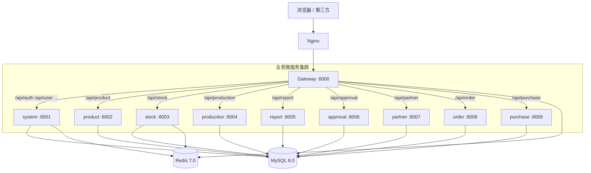

# 03 · 系统架构

## 一、架构总览

XEERP-FASTAPI 采用 **网关 + 业务微服务 + 共享内核** 的三段式架构。



- **Nginx**（生产可选）：TLS / 静态资源 / 反向代理 Gateway
- **Gateway**：唯一入口，统一鉴权、限流、日志、CORS、路由转发
- **业务微服务**：按业务域拆分，独立部署
- **MySQL / Redis**：所有服务共享同一套主从数据库与 Redis 实例

---

## 二、请求链路

以"查询用户列表" `GET /api/user/list` 为例：

```
1. Browser
    │  Header: Authorization: Bearer <jwt>
    ▼
2. Nginx (可选 TLS 卸载)
    ▼
3. Gateway :8000
    ├─ CORS Middleware
    ├─ LoggingMiddleware（记录 method/path/status/耗时/clientIP）
    ├─ AuthMiddleware（白名单放过，否则 verify_jwt_token）
    │     • 设置 request.state.user = payload
    ├─ slowapi 限流 (@limiter.limit)
    └─ gateway_router.proxy_request
          └─ httpx.AsyncClient.request -> http://127.0.0.1:8001/api/user/list
4. system :8001
    ├─ TraceMiddleware（trace_id 注入日志上下文）
    ├─ CORS / GZip Middleware
    ├─ register_routers -> v1 -> userController
    │     └─ Depends(get_db) -> AsyncSession
    ├─ service -> dao -> SQLAlchemy 异步查询
    └─ ResponseUtil.success(rows=..., dict_content={"total": ...})
5. Gateway 透传响应 -> Nginx -> Browser
```

---

## 三、统一目录结构

每个微服务遵循以下目录约定（以 `system` 为完整范例）：

```
{service}/
├── run.py                   # 入口：sys.path 注入 + uvicorn.run
├── server.py                # 装配：FastAPI app + lifespan + 中间件 + 路由 + 异常
├── gunicorn_conf.py         # 生产部署配置（仅 system 提供，可复制）
├── core/                    # 服务内核
│   ├── env.py               # 配置类 + .env 加载
│   ├── constant.py          # 常量定义
│   ├── enums.py             # 枚举
│   ├── exception.py         # 业务异常类
│   ├── handle.py            # 全局异常处理器
│   ├── database.py          # SQLAlchemy 异步 engine / sessionmaker
│   ├── get_db.py            # 依赖：async with AsyncSessionLocal() yield
│   ├── get_redis.py         # Redis pool / 缓存预热
│   ├── get_scheduler.py     # APScheduler 装配
│   ├── annotation/          # 自定义装饰器（日志/权限）
│   ├── aspect/              # AOP 切面
│   └── mounts/              # 子应用挂载（如静态文件）
├── middlewares/
│   ├── cors_middleware.py
│   ├── gzip_middleware.py
│   ├── trace_middleware/    # 自研 trace_id ASGI 中间件
│   └── handle.py            # 中间件统一注册入口
├── api/
│   ├── __init__.py          # register_routers(app) 装配 v1 路由
│   └── v1/
│       └── *_controller.py  # FastAPI APIRouter
├── service/                 # 业务逻辑层
├── dao/                     # 数据访问层（SQLAlchemy 查询封装）
├── models/                  # ORM 实体（声明式 Base）
├── schemas/                 # 请求/响应模型（pydantic）
├── clients/                 # 跨服务 HTTP 客户端（httpx）
├── script_task/             # 定时任务函数注册（@scheduler 可调用）
└── static/                  # 上传 / 下载 / 代码生成模板
```

> `gateway` 由于无 DB，目录简化为 `core/router/`；`purchase / approval / partner / order` 部分服务正按上述模板渐进完善。

---

## 四、共享内核（项目根 `utils/`）

`utils/` 包是**所有微服务**通过 `sys.path` 注入后共享的工具库，避免重复实现：

```
utils/
├── common_util.py        # 工具函数（驼峰转换、worship 等）
├── cron_util.py          # Cron 表达式工具
├── excel_util.py         # Excel 导入导出
├── gen_util.py           # 代码生成
├── import_util.py        # 数据导入
├── log_util.py           # 统一日志（TimedRotatingFileHandler + zip 归档）
├── message_util.py       # 消息推送
├── page_util.py          # 分页工具 PageUtil
├── pwd_util.py           # 密码工具（bcrypt）
├── response_util.py      # 统一响应 ResponseUtil
├── send_email_util.py    # 邮件发送
├── socket_client.py      # WebSocket 客户端
├── string_util.py        # 字符串工具
├── template_util.py      # 代码模板渲染
├── time_format_util.py   # 时间格式化
├── upload_util.py        # 文件上传
└── gen_templates/        # 代码生成模板
```

服务通过 `from utils.log_util import logger` 等方式直接 import；`run.py` 中通过

```python
project_root = os.path.dirname(os.path.dirname(os.path.abspath(__file__)))
sys.path.insert(0, project_root)
```

确保 `utils.*` 能被定位。

---

## 五、分层职责

| 层 | 目录 | 职责 | 不允许做的事 |
| -- | ---- | ---- | ------------ |
| Controller | `api/v1/*_controller.py` | 解析参数、调用 service、返回 `ResponseUtil` | 不写 SQL、不写复杂业务编排 |
| Service | `service/*.py` | 业务编排、事务、跨 DAO 协同 | 不直接构造 `JSONResponse` |
| DAO | `dao/*.py` | SQLAlchemy 查询封装、ORM 操作 | 不耦合 HTTP/请求对象 |
| Model | `models/*.py` | ORM 实体（继承 `Base`） | 不写业务逻辑 |
| Schema | `schemas/*.py` | 请求/响应 pydantic 模型 | 不与 ORM 实体互转（在 service 做） |
| Client | `clients/*.py` | 调用其他微服务（httpx） | 不直接被 controller 调用，service 调度 |

---

## 六、启动生命周期（以 system 为例）

```python
# system/server.py
@asynccontextmanager
async def lifespan(app: FastAPI):
    logger.info('⏰️ 开始启动')
    await init_create_table()                    # 1. 建表
    app.state.redis = await RedisUtil.create_redis_pool()  # 2. Redis 连接池
    await RedisUtil.init_sys_dict(app.state.redis)         # 3. 字典预热
    await RedisUtil.init_sys_config(app.state.redis)       # 4. 参数预热
    await RedisUtil.init_sys_user(app.state.redis)         # 5. 用户缓存
    await SchedulerUtil.init_system_scheduler()            # 6. 启动 APScheduler
    yield
    await RedisUtil.close_redis_pool(app)
    await SchedulerUtil.close_system_scheduler()
```

加载顺序后续为 `register_routers` → `handle_sub_applications` → `handle_middleware` → `handle_exception`。

---

## 七、对外接口前缀

| 前缀 | 转发到 |
| ---- | ------ |
| `/api/auth/**` `/api/user/**` `/api/role/**` `/api/menu/**` `/api/dept/**` `/api/config/**` `/system/**` | system |
| `/api/product/**` `/product/**` | product |
| `/api/stock/**` `/stock/**` | stock |
| `/api/production/**` `/production/**` | production |
| `/api/report/**` `/report/**` | report |

详见 [04-网关与路由 §三](./04-网关与路由.md#三路由表)。

---

## 八、设计权衡

| 权衡 | 现状 | 备注 |
| ---- | ---- | ---- |
| 同步/异步 | 全异步 | 但 APScheduler 的 SQLAlchemyJobStore 用同步 engine，两套并存 |
| 共享 DB / 库隔离 | 共享单库 + 表前缀 | 简化部署；强一致；后期可拆库 |
| 跨服务调用 | HTTP (httpx) | 简单清晰；后续可演进 gRPC / 消息总线 |
| 配置管理 | 各服务独立 `core/env.py` + 根 `.env` | 解耦端口与业务，但要小心字段重名 |
| 用户态 | JWT，无 session | 配合 `JWT_REDIS_EXPIRE_MINUTES` 实现"在线用户"列表 |
