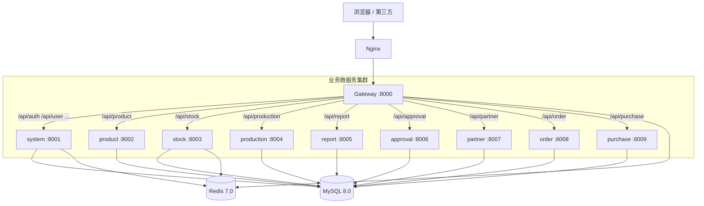

# 17 · 系统架构（整合版）

> 本文整合自 `03-系统架构.md`（实现细节版）与 `031-XEERP-FASTAPI 微服务架构设计文档.md`（设计规范版），形成完整的系统架构参考文档。
> 适用版本：v1.0 · 最近更新：2026-05

---

## 一、项目简介与设计目标

### 1.1 项目简介

XEERP-FASTAPI 是企业级进销存 ERP 微服务系统，按业务边界拆分为 **1 个网关 + 9 个业务微服务**，覆盖权限、商品、库存、生产、订单、采购、报表、审批、往来单位九大业务域。系统采用 **网关聚合 + 领域微服务** 模式，以 FastAPI 全异步技术栈驱动，搭配 Redis 缓存与 MySQL 持久层，满足企业日常进销存业务流转、权限管控与数据统计需求。

### 1.2 设计目标

| 目标 | 说明 |
| ---- | ---- |
| 高解耦 | 按业务域拆分微服务，单一职责，独立开发/部署/迭代 |
| 高性能 | Redis 缓存热点数据，全链路 `async/await`，原子库存控制 |
| 高可用 | 服务进程隔离，单服务故障不影响其他服务 |
| 易维护 | 统一分层架构、规范接口、统一日志与异常处理 |
| 可扩展 | 新增业务只需新增独立微服务，注册到网关即可接入 |

### 1.3 技术选型总览

| 分类 | 组件 | 作用 |
| ---- | ---- | ---- |
| 开发语言 | Python 3.12+ | 全栈语言 |
| Web 框架 | FastAPI + uvicorn + gunicorn | 异步 HTTP 服务、生产部署 |
| ORM 框架 | SQLAlchemy 2.x + asyncmy | 全异步数据库对象映射 |
| 主数据库 | MySQL 8.0+ | 业务数据持久化存储 |
| 缓存中间件 | Redis 7.0+ | 会话、字典、商品、库存缓存、限流 |
| 网关服务 | FastAPI Gateway（httpx 代理） | 路由转发、统一鉴权、跨域处理 |
| 网络请求 | httpx | 跨服务异步 HTTP 调用 |
| 身份鉴权 | JWT + bcrypt（pyjwt + passlib） | 用户登录认证、权限校验 |
| 序列化 | orjson | 高性能 JSON 序列化 |
| 定时任务 | APScheduler（AsyncIOScheduler） | 业务定时统计、数据同步 |
| 限流 | slowapi + Redis | 网关侧 IP 速率限制 |
| 配置管理 | pydantic-settings + python-dotenv | .env 配置加载、类型校验 |
| 日志处理 | 安全日志切割（TimedRotating + zip 归档） | 多进程兼容日志归档 |
| 前端框架 | Vue3 + Vite + Element Plus | 管理后台（基于 RuoYi-Vue3） |

---

## 二、整体架构总览

XEERP-FASTAPI 采用 **网关 + 业务微服务 + 共享内核** 的三段式架构。

```
前端管理后台（Vue3 + Vite）
        ↓
Nginx（生产可选：TLS / 静态资源 / 反向代理）
        ↓
统一网关 Gateway（:8000）
路由转发 / JWT 鉴权 / IP 限流 / CORS / 日志
        ↓
九大领域业务微服务集群
        ↓
MySQL 持久层 + Redis 缓存层
```

### 2.1 架构拓扑图



### 2.2 三层核心职责

| 层 | 组件 | 职责 |
| -- | ---- | ---- |
| 接入层 | Gateway :8000 | 统一请求入口，路由分发、JWT 鉴权、跨域、限流、日志 |
| 业务层 | 9 个领域微服务 | 独立进程，承载各领域核心业务逻辑 |
| 数据层 | MySQL + Redis | MySQL 主数据存储，Redis 高速缓存加速 |

---

## 三、微服务拆分清单

按业务边界垂直拆分，共 **1 个网关服务 + 9 个业务微服务**，服务间通过 HTTP 调用，互不直接耦合。

| 服务名称 | 服务标识 | 端口 | 核心业务职责 |
| -------- | -------- | ---- | ------------ |
| 网关服务 | gateway | 8000 | 路由转发、跨域、JWT 鉴权、限流 |
| 系统权限服务 | system | 8001 | 用户、角色、菜单、部门、字典、日志、定时任务 |
| 商品中心服务 | product | 8002 | 商品、分类（树形）、品牌、计量单位管理 |
| 库存中心服务 | stock | 8003 | 仓库、实时库存（Redis 缓存）、出入库流水 |
| 生产服务 | production | 8004 | BOM、生产计划、领料、入库、退料、损耗 |
| 报表服务 | report | 8005 | 生产进度、领料明细、入库成本、库存台账 |
| 审批流服务 | approval | 8006 | 审批流程定义、节点、审批实例、审批记录 |
| 往来单位服务 | partner | 8007 | 客户、供应商信息统一管理 |
| 订单服务 | order | 8008 | 销售/采购订单及明细、状态流转 |
| 采购服务 | purchase | 8009 | 采购单据、采购收货入库 |

---

## 四、请求链路（完整流程）

以"查询用户列表" `GET /api/user/list` 为例，完整描述一次请求的流转路径：

```
1. 前端浏览器
    │  Header: Authorization: Bearer <jwt>
    ▼
2. Nginx（可选，生产环境 TLS 卸载 / 静态资源分离）
    ▼
3. Gateway :8000
    ├─ CORS Middleware（跨域处理）
    ├─ LoggingMiddleware（记录 method/path/status/耗时/clientIP）
    ├─ AuthMiddleware（白名单放过，否则 verify_jwt_token）
    │     • request.state.user = payload（透传给下游）
    ├─ slowapi 限流（@limiter.limit，100次/60s/IP）
    └─ gateway_router.proxy_request
          └─ httpx.AsyncClient → http://127.0.0.1:8001/api/user/list
4. system :8001
    ├─ TraceMiddleware（trace_id 注入日志上下文）
    ├─ CORS / GZip Middleware
    ├─ register_routers → v1 → userController
    │     └─ Depends(get_db) → AsyncSession
    ├─ service → dao → SQLAlchemy 异步查询
    └─ ResponseUtil.success(rows=..., total=...)
5. Gateway 透传响应 → Nginx → 前端
```

### 服务间调用约束

1. 禁止循环调用，规避死循环阻塞
2. 统一请求超时 30 秒，避免请求堆积
3. 核心业务增加调用失败重试机制
4. 服务不可达：Gateway 返回 503 服务不可用

---

## 五、单服务内部分层结构

所有微服务统一六层分层结构（以 `system` 为完整参考）：

```
{service}/
├── run.py                   # 入口：sys.path 注入 + uvicorn.run
├── server.py                # 装配：FastAPI app + lifespan + 中间件 + 路由 + 异常
├── gunicorn_conf.py         # 生产部署配置（可复制自 system/）
├── core/                    # 服务内核
│   ├── env.py               # 配置类 + .env 加载（pydantic-settings）
│   ├── constant.py          # 常量定义
│   ├── enums.py             # 枚举
│   ├── exception.py         # 业务异常类
│   ├── handle.py            # 全局异常处理器
│   ├── database.py          # SQLAlchemy 异步 engine / sessionmaker
│   ├── get_db.py            # 依赖：async with AsyncSessionLocal() yield
│   ├── get_redis.py         # Redis pool / 缓存预热
│   ├── get_scheduler.py     # APScheduler 装配（system 服务专用）
│   ├── annotation/          # 自定义装饰器（日志/权限）
│   ├── aspect/              # AOP 切面
│   └── mounts/              # 子应用挂载（静态文件等）
├── middlewares/
│   ├── cors_middleware.py
│   ├── gzip_middleware.py
│   ├── trace_middleware/    # 自研 trace_id ASGI 中间件
│   └── handle.py            # 中间件统一注册入口
├── api/
│   ├── __init__.py          # register_routers(app) 装配 v1 路由
│   └── v1/
│       └── *_controller.py  # FastAPI APIRouter
├── service/                 # 业务逻辑层
├── dao/                     # 数据访问层（SQLAlchemy 查询封装）
├── models/                  # ORM 实体（声明式 Base）
├── schemas/                 # 请求/响应模型（pydantic）
├── clients/                 # 跨服务 HTTP 客户端（httpx）
├── script_task/             # 定时任务函数注册
└── static/                  # 上传 / 下载 / 代码生成模板
```

> **注意**：`gateway` 无 DB，目录简化为 `core/ + router/`；`purchase / approval / partner / order` 部分服务正按上述模板渐进完善。

### 各层职责

| 层 | 目录 | 职责 | 禁止事项 |
| -- | ---- | ---- | -------- |
| Controller | `api/v1/*_controller.py` | 解析请求参数、调用 Service、返回 `ResponseUtil` | 不写 SQL，不写业务编排 |
| Service | `service/*.py` | 业务编排、事务控制、跨 DAO 协同 | 不直接构造 `JSONResponse` |
| DAO | `dao/*.py` | SQLAlchemy 查询封装、ORM 操作 | 不耦合 HTTP/请求对象 |
| Model | `models/*.py` | ORM 实体（继承 `Base`） | 不写业务逻辑 |
| Schema | `schemas/*.py` | 请求/响应 pydantic 模型，自动数据校验 | 不与 ORM 实体互转（在 Service 做） |
| Client | `clients/*.py` | 封装跨服务 httpx 异步调用 | 不直接被 Controller 调用，由 Service 调度 |

---

## 六、共享内核（项目根 `utils/`）

`utils/` 包是**所有微服务**通过 `sys.path` 注入后共享的工具库，避免重复实现：

```
utils/
├── response_util.py      # 统一响应 ResponseUtil ⭐⭐⭐
├── page_util.py          # 分页工具 PageUtil     ⭐⭐⭐
├── log_util.py           # 统一日志（TimedRotatingFileHandler + zip 归档）⭐⭐⭐
├── common_util.py        # 驼峰转换、worship 等通用函数
├── pwd_util.py           # 密码 hash/verify（bcrypt）
├── upload_util.py        # 文件上传处理
├── excel_util.py         # Excel 导入导出
├── cron_util.py          # Cron 表达式解析工具
├── gen_util.py           # 代码生成
├── import_util.py        # 批量数据导入
├── template_util.py      # 代码模板渲染
├── string_util.py        # 字符串操作工具
├── time_format_util.py   # 时间格式化
├── socket_client.py      # WebSocket 客户端
├── send_email_util.py    # 邮件发送（占位）
├── message_util.py       # 消息推送（占位）
└── gen_templates/        # 代码生成模板
```

各服务 `run.py` 通过以下方式注入路径，确保 `utils.*` 能被定位：

```python
project_root = os.path.dirname(os.path.dirname(os.path.abspath(__file__)))
sys.path.insert(0, project_root)
```

---

## 七、网关核心设计

### 7.1 核心功能

1. **统一请求入口**：所有前端请求仅访问网关端口（:8000），隔离后端服务地址
2. **路由匹配转发**：根据 URL 前缀匹配对应业务微服务，基于 `service_routes` 字典
3. **跨域全局处理**：统一配置 CORS，各下游服务无需重复处理
4. **请求透传**：完整转发请求头、参数、请求体，兼容 form/json/multipart

### 7.2 路由匹配规则

```
/system/**         → system-service  :8001
/api/user/**       → system-service  :8001
/api/role/**       → system-service  :8001
/api/auth/**       → system-service  :8001
/api/config/**     → system-service  :8001
/api/product/**    → product-service :8002
/api/stock/**      → stock-service   :8003
/api/production/** → production-service :8004
/api/report/**     → report-service  :8005
```

> 详见 [04-网关与路由](./04-网关与路由.md)。

### 7.3 网关异常处理

| 情况 | HTTP 状态 | 说明 |
| ---- | --------- | ---- |
| 路由不匹配 | 404 | "未找到对应的服务" |
| 下游不可达 | 503 | "服务不可用: {错误详情}" |
| 限流命中 | 429 | "请求过于频繁，请稍后再试" |
| 网关自身异常 | 500 | "网关错误: {错误详情}" |

---

## 八、数据层架构设计

### 8.1 MySQL 数据库设计

| 设计点 | 说明 |
| ------ | ---- |
| 定位 | 唯一真实数据源，所有单据、库存、财务数据以库为准 |
| 表命名 | 统一前缀 `sys_`，格式：`sys_{module}_{entity}` |
| 通用字段 | `create_time` / `update_time` / `create_user` / `update_user` / `is_delete`（逻辑删除） |
| 事务管控 | 订单、出入库、采购等核心业务开启数据库事务保证一致性 |
| 主从分离 | `.env` 已预留 `DB_MASTER_*` / `DB_SLAVE_*` 字段，可扩展读写分离 |

### 8.2 Redis 缓存应用设计

#### 8.2.1 缓存使用场景

| 场景 | Key 模式 | 说明 |
| ---- | -------- | ---- |
| 用户会话 | `ACCESS_TOKEN:{session_id}` | 登录 Token，JWT 在线用户管理 |
| 登录验证码 | `CAPTCHA_CODE:{uuid}` | 图片验证码，2 分钟过期 |
| 密码错误计数 | `PASSWORD_ERROR_COUNT:{username}` | 5 次锁定 |
| 账号锁定 | `ACCOUNT_LOCK:{username}` | 锁定标记，10 分钟自动解锁 |
| 字典缓存 | `sys_dict:{dict_type}` | 系统启动预热 |
| 参数缓存 | `sys_config:{config_key}` | 系统启动预热 |
| 实时库存 | 商品-仓库维度 | 原子计数，防止超卖 |
| 接口限流 | slowapi + Redis | 100次/60s/IP |

#### 8.2.2 缓存一致性策略

1. **写入规则**：先更新 MySQL 数据库，再删除/更新对应 Redis 缓存
2. **查询规则**：优先查询缓存，缓存缺失时查询数据库并回写缓存
3. **过期兜底**：业务缓存统一设置过期时间，自动清理脏数据
4. **核心约束**：财务对账、月结盘点**仅以 MySQL 数据为准**

#### 8.2.3 可靠性保障

- 开启 RDB + AOF 双重持久化，防止 Redis 重启数据丢失
- 内网隔离访问，配置密码鉴权提升安全性
- 连接池统一在服务启动 `lifespan` 中创建，通过 `app.state.redis` 共享

---

## 九、启动生命周期（以 system 为例）

```python
# system/server.py
@asynccontextmanager
async def lifespan(app: FastAPI):
    logger.info('⏰️ 开始启动')
    await init_create_table()                              # 1. 自动建表
    app.state.redis = await RedisUtil.create_redis_pool() # 2. Redis 连接池
    await RedisUtil.init_sys_dict(app.state.redis)        # 3. 字典预热
    await RedisUtil.init_sys_config(app.state.redis)      # 4. 参数预热
    await RedisUtil.init_sys_user(app.state.redis)        # 5. 用户缓存
    await SchedulerUtil.init_system_scheduler()           # 6. 启动 APScheduler
    logger.info('🚀 启动成功')
    yield
    await RedisUtil.close_redis_pool(app)                 # 关闭 Redis 连接池
    await SchedulerUtil.close_system_scheduler()          # 停止定时任务
```

装配顺序：`register_routers` → `handle_sub_applications` → `handle_middleware` → `handle_exception`

---

## 十、日志与异常架构

### 10.1 日志设计

1. 采用自定义安全日志处理器，解决 Windows 多进程文件占用报错
2. 按服务独立日志文件，存放在项目根 `logs/` 目录，按日期自动切割归档
3. 日志级别：`INFO`（正常运行）/ `WARNING`（业务警告）/ `ERROR`（异常错误）
4. 日志格式：`时间 | 级别 | 模块:函数:行号 - 消息内容`，方便问题定位
5. Trace 中间件（`TraceASGIMiddleware`）为每个请求注入 `trace_id`，关联完整请求日志

### 10.2 异常处理

| 异常类 | HTTP 状态 | 使用场景 |
| ------ | --------- | -------- |
| `LoginException` | 401 | 登录失败、Token 校验失败 |
| `AuthException` | 403 | 权限不足 |
| `PermissionException` | 403 | 数据权限拒绝 |
| `ServiceException` | 200（code=500） | 业务异常（预期） |
| `ServiceWarning` | 200（code=-1） | 业务警告（可预期失败） |
| `ModelValidatorException` | 422 | 参数校验失败 |
| 未处理 `Exception` | 200（code=500） | 兜底捕获，记录日志 |

> 所有业务异常统一通过 `ResponseUtil` 包装为标准 JSON，不直接暴露后端错误详情给前端。

---

## 十一、部署与启动规范

### 11.1 前置环境

| 组件 | 版本要求 | 说明 |
| ---- | -------- | ---- |
| Python | 3.12+ | 必装，配置环境变量 |
| MySQL | 8.0+ | 创建数据库，配置 `.env` |
| Redis | 7.0+ | 启动服务，默认端口可访问 |
| Node.js | 18+ | 前端 `web-ui` 时需要，可选 |

### 11.2 服务启动顺序

```
system (8001) → product/stock/partner (8002/8003/8007)
              → production/order (8004/8008)
              → report/approval/purchase (8005/8006/8009)
              → gateway (8000)  ← 最后启动
```

```bash
cd system && python run.py      # 终端1
cd product && python run.py     # 终端2
cd stock && python run.py       # 终端3
cd production && python run.py  # 终端4
cd gateway && python run.py     # 终端5（最后）
```

### 11.3 访问地址

| 入口 | 地址 |
| ---- | ---- |
| 网关统一入口 | `http://127.0.0.1:8000` |
| 网关 Swagger | `http://127.0.0.1:8000/api/docs` |
| system Swagger | `http://127.0.0.1:8001/api/docs` |
| 各服务健康检查 | `http://127.0.0.1:{port}/health` |
| 前端管理后台 | `http://localhost:80`（开发模式） |

### 11.4 生产部署注意事项

- Windows 环境关闭多进程 `workers`（`gunicorn_conf.py`），避免日志文件占用异常
- `.env` 中关闭 `APP_RELOAD=false`、`DB_MASTER_ECHO=false`
- 每个服务注册为独立 `systemd unit`，配合 `doc/auto-restart.sh` 防止进程卡死
- Nginx 反向代理 Gateway，处理 TLS 与静态资源

---

## 十二、设计权衡

| 权衡点 | 当前选择 | 说明与后续演进方向 |
| ------ | -------- | ------------------ |
| 同步 / 异步 | 全异步 | APScheduler 的 SQLAlchemyJobStore 需同步 engine，两套并存 |
| 共享库 / 库隔离 | 共享单库 + 表前缀 `sys_` | 简化部署，保持强一致；业务增长后可按服务拆库 |
| 跨服务调用 | HTTP（httpx）直连 | 简单清晰；后续可演进 gRPC 或消息总线（RabbitMQ/Kafka） |
| 服务发现 | 静态 URL（env.py 配置） | 当前适合单机/固定 IP 部署；横向扩展可引入 Consul/Nacos |
| 配置管理 | 各服务 `core/env.py` + 根 `.env` | 解耦端口与业务配置，注意字段命名冲突 |
| 用户态 | JWT 无状态 | 配合 Redis `ACCESS_TOKEN` 实现"在线用户"列表与强制下线 |
| 前端分离 | 独立 `web-ui/`（Vue3） | 后端纯 REST，前后端完全解耦 |

---

## 十三、架构优势总结

1. **服务解耦**：业务边界清晰，单独开发部署，单服务故障互不影响
2. **技术统一**：全部服务统一 FastAPI + SQLAlchemy 技术栈，新人上手成本低
3. **性能优异**：Redis 缓存大幅降低数据库压力，全链路异步响应迅速
4. **缓存预热**：字典、参数、用户信息启动时预加载 Redis，热点接口纳秒级响应
5. **运维简便**：统一分层、统一日志规范、Trace 链路追踪，问题定位高效
6. **可扩展性强**：新增业务直接新增微服务，在 gateway `env.py` + `gateway_router.py` 注册即可接入，原有架构无需改动
7. **共享内核**：`utils/` 工具库全服务共用，避免重复造轮子

---

## 十四、相关文档

| 文档 | 内容 |
| ---- | ---- |
| [04-网关与路由](./04-网关与路由.md) | Gateway 详细实现、路由表、限流配置 |
| [05-认证与权限](./05-认证与权限.md) | JWT 签发、RBAC 模型、登录安全策略 |
| [06-数据库与缓存](./06-数据库与缓存.md) | SQLAlchemy 配置、Redis 使用、事务管理 |
| [07-中间件与异常](./07-中间件与异常.md) | 中间件链路、全局异常处理体系 |
| [08-公共工具库](./08-公共工具库.md) | utils/ 各工具使用说明 |
| [12-开发指南](./12-开发指南.md) | 新增接口/服务规范、部署 Checklist |
