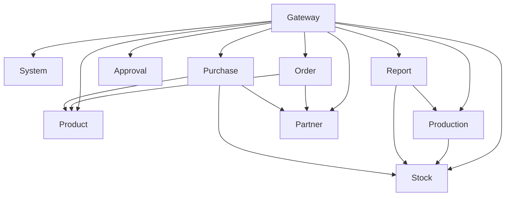

# 09 · 业务服务详解

本文逐一介绍各业务微服务的职责、数据模型与核心流程。

---

## 一、product — 商品中心（:8002）

### 1.1 模块

| 模块 | 数据表 | 功能 |
| ---- | ------ | ---- |
| 商品管理 | `sys_product` | 商品 CRUD、关联分类/品牌/单位 |
| 分类管理 | `sys_product_category` | 树形结构（parent_id），支持多级 |
| 品牌管理 | `sys_product_brand` | 品牌 CRUD |
| 单位管理 | `sys_product_unit` | 计量单位 CRUD |

### 1.2 跨服务调用

通过 `clients/` 调用 `system` 服务的鉴权能力（`auth_client.py` / `system_client.py`），使用 `base_client.py` 封装 httpx 公共逻辑。

---

## 二、stock — 库存中心（:8003）

### 2.1 模块

| 模块 | 数据表 | 功能 |
| ---- | ------ | ---- |
| 仓库管理 | `sys_warehouse` | 仓库 CRUD |
| 库存管理 | `sys_inventory` | 商品-仓库维度库存数，Redis 缓存热点 |
| 库存流水 | `sys_inventory_flow` | 出入库变动记录，全链追溯 |

### 2.2 关键特性

- **Redis 缓存**：高频访问商品实时库存走 Redis，减轻 DB 压力
- **库存变动必须同步写入流水**：保证审计可追溯
- **并发安全**：通过数据库行锁（`SELECT ... FOR UPDATE`）处理并发扣减

---

## 三、production — 生产中心（:8004）

### 3.1 模块

| 模块 | 数据表 | 功能 |
| ---- | ------ | ---- |
| BOM 管理 | `sys_bom` / `sys_bom_item` | 物料清单（成品 → 物料配比） |
| 生产计划 | `sys_production_plan` | 计划创建/审核/启动/关闭 |
| 生产领料 | `sys_production_issue` / `..._item` | 从仓库领取生产物料 |
| 生产入库 | `sys_production_receipt` | 成品入库 |
| 生产退料 | `sys_production_return` / `..._item` | 剩余物料退回仓库 |
| 生产损耗 | `sys_production_scrap` / `..._item` | 记录生产过程中报废物料 |

### 3.2 业务流程

```
生产计划 → 审核（approval）→ 领料（扣库存）→ 生产 → 入库（加库存）→ 退料/损耗
```

- 领料自动调用 `stock` 服务扣减库存
- 入库自动调用 `stock` 服务增加库存
- 审核可走 `approval` 服务（统一审批流）

---

## 四、report — 报表中心（:8005）

### 4.1 报表清单

| 报表 | 数据来源 | 用途 |
| ---- | -------- | ---- |
| 生产进度报表 | `production` 服务 | 生产计划完成率、进度追踪 |
| 领料明细报表 | `production` 服务 | 物料消耗汇总 |
| 入库成本报表 | `production` 服务 | 入库成本统计分析 |
| 库存台账 | `stock` 服务 | 库存变动明细 |

### 4.2 调用方式

通过 `clients/` 目录下的 HTTP client 调用上游服务 API，聚合数据后返回。

---

## 五、approval — 审批流（:8006）

### 5.1 模块

| 模块 | 数据表 | 功能 |
| ---- | ------ | ---- |
| 流程定义 | `sys_approval_flow` | 审批流程配置（名称、类型） |
| 节点定义 | `sys_approval_node` | 审批节点（顺序、审批人/角色） |
| 审批实例 | `sys_approval_instance` | 一次具体审批（关联业务单据） |
| 审批记录 | `sys_approval_record` | 每个节点的审批操作记录 |

### 5.2 支持审批类型

- 生产计划审批
- 生产领料审批
- 采购订单审批
- 可扩展更多（按 `flow_type` 枚举）

---

## 六、partner — 往来单位（:8007）

| 字段组 | 内容 |
| ------ | ---- |
| 基本信息 | 名称、编号、类型（customer/supplier/both） |
| 联系人 | 联系人姓名、电话、邮箱 |
| 地址 | 省、市、区、详细地址 |
| 财务 | 税号、银行账户、开户行 |
| 信用 | 信用额度、信用天数 |

---

## 七、order — 订单中心（:8008）

| 模块 | 数据表 | 功能 |
| ---- | ------ | ---- |
| 订单管理 | `sys_order` | 订单 CRUD |
| 订单明细 | `sys_order_item` | 商品/数量/单价 |

**订单类型**：`sales`（销售）/ `purchase`（采购）

**状态流转**：`pending → confirmed → shipped → completed → cancelled`

---

## 八、purchase — 采购中心（:8009）

| 模块 | 数据表 | 功能 |
| ---- | ------ | ---- |
| 采购单 | `sys_purchase_order` | 采购 CRUD |
| 采购明细 | `sys_purchase_item` | 商品/数量/单价 |
| 采购收货 | - | 到货后调用 stock 入库 |

**状态流转**：`pending → approved → ordered → received → completed → cancelled`

---

## 九、服务间调用关系总览



---

## 十、扩展路径建议

| 业务需求 | 建议方案 |
| -------- | -------- |
| 销售退货 | 在 `order` 服务新增 `return` 模块 |
| 仓库调拨 | 在 `stock` 服务新增 `transfer` 模块 |
| 供应商评价 | 在 `partner` 服务新增 `evaluation` 模块 |
| 多仓策略 | `stock` 服务配合策略引擎分配仓库 |
| 财务模块 | 新建 `finance` 服务（应收/应付/对账） |
